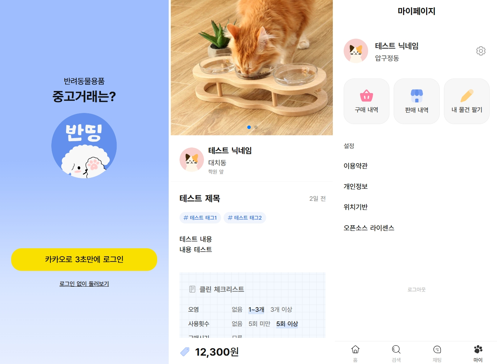

# 반띵: 믿을 수 있는 반려동물 용품 중고 거래 사이트 

 

  

[https://banthing.net/](https://banthing.net/ "반띵: 믿을 수 있는 반려동물 용품 중고 거래 사이트") 

 

### 📅 제작 기간

2024.11.04 ~ ??
  

### 🔧 개발 도구

-   사용 언어 및 셋업
    -  Type Script & React vite
-  API 통신
    -   Axios    
    -   Tanstack query
-   상태 관리
    -   Zustand
-   스타일링
    -   Styled Components
-   그 외 
    -   Framer Motion
    -   React hook form
    -   etc...
      

### 🗂️ 프로젝트 구조
체계적인 계층 분리를 위한 클린 아키텍처 구성
1. 코어 영역: 외부의 영향을 받지 않으며 핵심 업무 규칙이 설정되는 영역
    - type 폴더: API로 주고받는 상품, 유저, 주소, 채팅 데이터의 타입 설정
    - lib 폴더: 상수, 지역 텍스트 리스트 등
    - store 폴더: 현재 위치, 좌표, 모달 등의 전역 상태 관리 코드
2. 컨트롤러 영역: 외부 데이터를 요청하거나 가공하여 UI 영역에 전달하는 영역
    - hooks 폴더: 재사용 가능한 커스텀 훅. 지역 불러오기 및 설정, 이미지 업로드, API 호출 및 요청 쿼리 함수 등
    - utils 폴더: 프로젝트 전반에 사용되는 공용 기능. 날짜와 시간 포맷, 쿠키 관리, 이미지 세팅 등
3. UI 영역: 사용자에게 노출되며 가장 변동이 많은 영역
    - components 폴더: 페이지를 구성하는 기본 요소들
        - atoms 폴더: 가장 작은 단위의 원자 컴포넌트. 버튼, 인풋, 타이틀 등
        - molecules 폴더: 원자들이 모인 분자 컴포넌트. 아이템 컨테이너, 사용자 프로필, 버튼 그룹 등
        -  layout: 홈, 아이템 목록, 아이템 조회, 검색 페이지 등 웹페이지를 구성하는 레이아웃 설정
    - pages 폴더: 컴포넌트를 조합한 실제 웹페이지

### 🎈주요 기능

-   카카오 연동 간편 로그인
-   현재 위치를 기반으로 하는 주소 설정
-   주소에 맞는 상품 목록 조회
-   클린 체크리스트, 해시태그 등 상세한 설정이 가능한 상품 판매글 작성
-   필터, 해시태그를 이용한 상품 상세 검색
-   상품 판매자와 실시간으로 소통할 수 있는 채팅
      

### ✔ 미리보기

